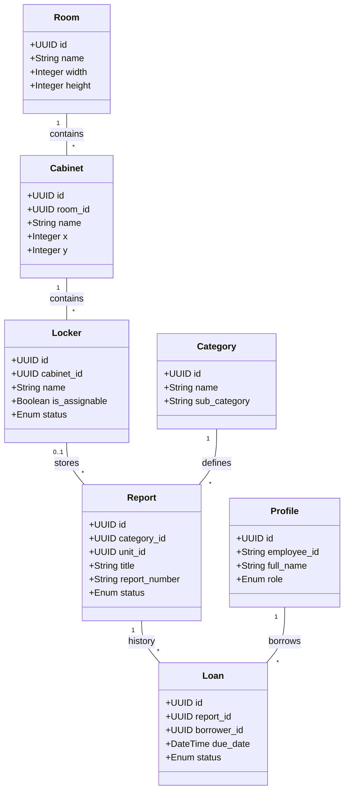

# Diagram Arsitektur Archivist Core (PRMS)

Dokumen ini berisi diagram teknis untuk proyek Archivist Core menggunakan sintaks **Mermaid**.

---

## 1. Use Case Diagram
Diagram ini mendefinisikan interaksi antara pengguna (Admin & Staff) dengan fitur-fitur sistem.

```mermaid
useCaseDiagram
    actor "Admin" as A
    actor "Staff" as S

    package "Sistem Archivist Core" {
        usecase "Kelola Layout Gudang (Architect)" as UC1
        usecase "Verifikasi Fisik & Approval" as UC2
        usecase "Kelola Master Data & User" as UC3
        usecase "Pendaftaran Arsip (Deposit)" as UC4
        usecase "Peminjaman Arsip (Loan)" as UC5
        usecase "Konfirmasi Penempatan Fisik" as UC6
        usecase "Pencarian Semantik (Vector)" as UC7
        usecase "Login & Manajemen Profil" as UC8
    }

    A --> UC1
    A --> UC2
    A --> UC3
    A --> UC8
    
    S --> UC4
    S --> UC5
    S --> UC6
    S --> UC7
    S --> UC8
```

---

## 2. Activity Diagram: Alur Penyimpanan (Deposit)
Diagram ini menjelaskan langkah-langkah sinkronisasi antara data digital dan penempatan fisik.

```mermaid
activityDiagram
    start
    :Staff memilih Loker di Peta;
    :Staff input metadata laporan;
    :Status: PENDING;
    |Admin|
    :Admin menerima notifikasi Approval;
    :Admin melakukan verifikasi fisik dokumen;
    if (Fisik Sesuai?) then (Ya)
        :Admin Approve;
        :Status: PENDING_PLACEMENT;
    else (Tidak)
        :Admin Reject;
        stop
    endif
    |Staff|
    :Staff meletakkan dokumen di loker;
    :Staff klik 'Konfirmasi Penempatan';
    :Status: ARCHIVED;
    stop
```

---

## 3. Class Diagram
Struktur data utama berdasarkan skema database (Drizzle/PostgreSQL).



---

## 💡 Cara Menggunakan Script Ini

### Option 1: Di GitHub / VS Code
GitHub secara native mendukung Mermaid. Anda cukup memasukkan kode di atas ke dalam blok kode markdown seperti ini:
```markdown
`​``mermaid
[Isi Script Mermaid]
`​``
```
VS Code juga akan merender diagram ini jika Anda memiliki ekstensi "Markdown Preview Mermaid Support".

### Option 2: Draw.io (Diagrams.net)
1. Buka [app.diagrams.net](https://app.diagrams.net/).
2. Pilih menu **Arrange** > **Insert** > **Advanced** > **Mermaid...**.
3. Tempelkan script di atas ke dalam kotak teks yang muncul.
4. Klik **Insert**.

### Option 3: Mermaid Live Editor
1. Buka [Mermaid Live Editor](https://mermaid.live/).
2. Tempelkan script di kolom "Code".
3. Anda bisa mengunduh hasilnya dalam format PNG atau SVG.
